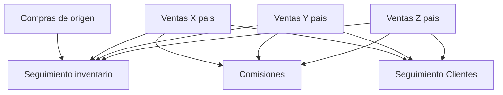

```mermaid
  graph TD;
	A[Compras de origen]-->G;
	B[Ventas X pais]-->E;
	C[Ventas Y pais]-->E;
	D[Ventas Z pais]-->E;		
	E[Comisiones];
	B --> F[Seguimiento Clientes];
	C --> F[Seguimiento Clientes];
	D --> F[Seguimiento Clientes];
	B --> G[Seguimiento inventario];
	C --> G[Seguimiento inventario];
	D --> G[Seguimiento inventario];
```